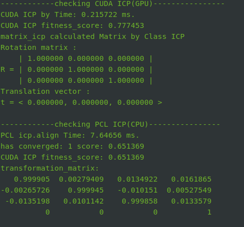

> 第二月的记录不知道为啥丢了，重新开始记录吧，反正过完年来了后感觉也没干啥，就是注释了代码
>
> 感觉上了段时间班，没有之前的动力了，必须要好好学习冲刺秋招啦

# 2024/02/14

> 1. 上午读了下，高博slam书的第九章离线地图构建，第十章自动驾驶车辆的实时定位系统。思路如下
>    - 地图分块
>    - 给个初始位姿
>    - 搜索，配准
> 2. 下午看下[FAST_LIO_LOCALIZATION](https://github.com/HViktorTsoi/FAST_LIO_LOCALIZATION)如何实现重定位。动手实现ros2版本。
>    - 没有数据，没法验证，等2月15日写现场采集数据，测试。

# 2024/02/17

> 完成了地图分块，将其集成到工程中。

## 地图分块

注意要以塔基坐标系为基础才行

# 2024/02/18

> 根据回转角变幅获得小车在地图中的位置。
> 塔吊坏掉了，后边不知道咋整，先找个数据集整着吧。

# 2024/02/19

> - 写了一个管理多种配准算法的类。已加入icp，ndt
> - **[fast_gicp](https://github.com/koide3/fast_gicp)**集成一下试一试，等有数据了可以试试效果。

编译fast_gicp时，不使用cuda的版本正常编译。

cuda版本报错，解决方法如下：

- 拉取源码时，三方库问题，[gitee拉取](https://blog.csdn.net/dss0606/article/details/132963284)

- cuda版本，在CMakeLists.txt中将`BUILD_VGICP_CUDA`设置为`ON`

- Eigen/core.h找不到，加这句话

  ```
  include_directories("/usr/include/eigen3/")
  ```

- pcl报了一堆错误，仔细查看若是C++版本原因，`"-std=c++0x"`太旧，设置

  ```
  set(CMAKE_CXX_STANDARD 14)
  ```


# 2024/02/20

> - 雷达驱动还是有问题，可能是资源调度有问题，仿照之前custom_msg代码，实现pointcloud2格式
>   - [根据此修改，不知道效果](https://blog.csdn.net/qq_46028284/article/details/143788949)
>   - [评价较好的修改版本，但是是用于仿真](https://blog.csdn.net/qq_32761549/article/details/134873919)

# 2024/02/22

> 今天回学校报道注册

[fast_icp](https://github.com/koide3/fast_gicp)测试，多线程版本的可以达到100帧，但是cuda版本的无法使用，不知道为啥

[cuPcl](https://github.com/NVIDIA-AI-IOT/cuPCL)测试，效果如下



其中环境配置需要使用:

- [cuda](https://zhuanlan.zhihu.com/p/705145901)
- [cudnn](https://blog.csdn.net/takedachia/article/details/130375718)
- 另外需要配置cmakelists中pcl和vtk相关目录

# 2024/02/24

> 1. 已回哈尔滨，请假一周，完成老师传感器485通信，qt制作
> 2. 解决报错
>    - `typora`可能是不小心更新了，需要彻底删除才能重新激活。
>    - `rcl`错误，没搜到解决办法，重装ros-`humble`

试一试重定位，因为重定位只需要做一次，后续在先验地图上就可以根据重定位后用里程计输出的位姿来匹配当前位置，可以以此作为初始位姿，再进行一次重定位，更准。

[FAST_LIO_LOCALIZATION](https://github.com/HViktorTsoi/FAST_LIO_LOCALIZATION)是一个较简单的重定位框架，使用python写的，试一下转为ros2

## ros1的包转ros2

由于数据集一直录制错误，找到一个ros bag包转换工具，[rosbags](https://pypi.org/project/rosbags/)

ros1到ros2

```c
rosbags-convert --src ./ros1.bag  --dst ./outdoor
```

## 报错

想用buildmap建个图，编译遇到报错，搜不到解决办法

```c
/opt/ros/humble/include/rclcpp/rclcpp/any_subscription_callback.hpp:806:9: error: using invalid field ‘rclcpp::AnySubscriptionCallback<MessageT, AllocatorT>::callback_variant_’
  806 |     if (callback_variant_.index() == 0) {
      |         ^~~~~~~~~~~~~~~~~
/opt/ros/humble/include/rclcpp/rclcpp/any_subscription_callback.hpp:807:23: error: using invalid field ‘rclcpp::AnySubscriptionCallback<MessageT, AllocatorT>::callback_variant_’
  807 |       if (std::get<0>(callback_variant_) == nullptr) {

```

# 2024/02/25

> - 终于是完成了ros1到ros2自定义消息的转换
>
> - 刷题

在ros1环境下，把ros bag自定义消息改了，然后用转换为ros2

## ubuntu22.04在ros1下安装livox驱动

[报错解决方法](https://github.com/Livox-SDK/livox_ros_driver/pull/110)

## 转换

注意需要在ros1环境下运行，这样才可以找到自定义消息`livox_ros_driver.msg`，而且还要source一下`livox_ros_driver2`

同理要实现转换为`livox_interfaces`，就需要在ros1环境下自定义这个功能包，然后生成msg

运行

```
python3 ./xxx.py
```


```
#!/usr/bin/env python

import rosbag
import rospy
from livox_ros_driver.msg import CustomMsg as LivoxCustomMsg
from livox_ros_driver2.msg import CustomMsg as LivoxCustomMsgV2, CustomPoint as LivoxCustomPointV2
# from livox_interfaces.msg import CustomMsg as LivoxCustomMsgV2, CustomPoint as LivoxCustomPointV2
from std_msgs.msg import Header

def convert_rosbag(input_bag, output_bag):
    # 打开原始 bag 文件进行读取
    with rosbag.Bag(input_bag, 'r') as in_bag:
        # 创建一个新的 bag 文件用于保存转换后的消息
        with rosbag.Bag(output_bag, 'w') as out_bag:
            for topic, msg, t in in_bag.read_messages():
                # 打印出当前的 topic 和消息类型，确保我们检查到正确的消息
                rospy.loginfo(f"Processing topic {topic}, message type: {type(msg)}")

                # 如果话题是 /livox/lidar 且消息类型是 livox_ros_driver/msg/CustomMsg，则进行转换
                if topic == '/livox/lidar' :
                    rospy.loginfo(f"Converting message on topic {topic} with timestamp {t}")

                    # 创建新的消息
                    new_msg = LivoxCustomMsgV2()

                    # 转换 header 字段
                    new_msg.header.stamp = msg.header.stamp
                    new_msg.header.frame_id = msg.header.frame_id

                    # 复制其他字段
                    new_msg.timebase = msg.timebase
                    new_msg.point_num = msg.point_num
                    new_msg.lidar_id = msg.lidar_id
                    new_msg.rsvd = msg.rsvd

                    # 转换 CustomPoint 数组
                    new_msg.points = []
                    for point in msg.points:
                        new_point = LivoxCustomPointV2()
                        new_point.offset_time = point.offset_time
                        new_point.x = point.x
                        new_point.y = point.y
                        new_point.z = point.z
                        new_point.reflectivity = point.reflectivity
                        new_point.tag = point.tag
                        new_point.line = point.line
                        new_msg.points.append(new_point)

                    # 将转换后的消息写入新的 bag 文件
                    out_bag.write(topic, new_msg, t)

                    rospy.loginfo(f"Message successfully converted and written to {output_bag}")

                else:
                    # 对于其他话题，直接将原消息写入新文件
                    out_bag.write(topic, msg, t)

if __name__ == '__main__':
    # 输入原始 bag 文件和输出文件路径
    input_bag = './demo.bag'  # 替换为你的原始 bag 文件路径
    output_bag = './demo01.bag'  # 替换为你希望生成的输出文件路径

    # 执行转换
    rospy.init_node('rosbag_converter')
    convert_rosbag(input_bag, output_bag)

    rospy.loginfo("Rosbag conversion completed!")

```

# 2024/03/10

> 终于是从学校回来了，打算4月1日离职

从50s处开始运行bag包

```
ros2 bag play ./xiaoche --start-offset 50
```

# 2024/03/12

判断`/livox/lidar`话题无数据

# 2024/03/18

完成由粗到精的重定位，cpu占用率过高，后续可优化的地方，按之前想法，将地图分块，只取其中一部分地图。


